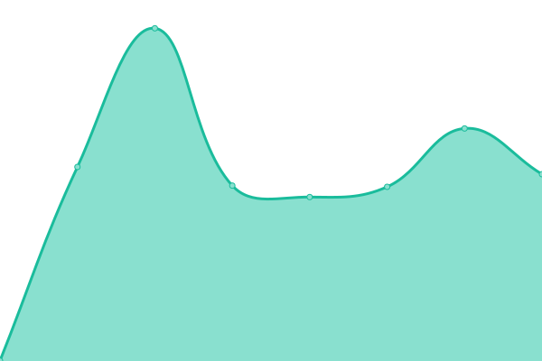

# [📈 Live Status](https://bhiwolfc.github.io/upptime): <!--live status--> **🟧 Partial outage**

This repository contains the open-source uptime monitor and status page for [Christian G. Wolf](https://bhiwolfc.github.io/upptime), powered by [Upptime](https://github.com/upptime/upptime).

With [Upptime](https://upptime.js.org), you can get your own unlimited and free uptime monitor and status page, powered entirely by a GitHub repository. We use [Issues](https://github.com/bhiwolfc/upptime/issues) as incident reports, [Actions](https://github.com/bhiwolfc/upptime/actions) as uptime monitors, and [Pages](https://bhiwolfc.github.io/upptime) for the status page.

<!--start: status pages-->
<!-- This summary is generated by Upptime (https://github.com/upptime/upptime) -->
<!-- Do not edit this manually, your changes will be overwritten -->
<!-- prettier-ignore -->
| URL | Status | History | Response Time | Uptime |
| --- | ------ | ------- | ------------- | ------ |
|  [forty-two times ten - Inh. Christian Wolf (dom,https)](https://42x10.de) | 🟩 Up | [forty-two-times-ten-inh-christian-wolf-dom-https.yml](https://github.com/bhiwolfc/upptime/commits/HEAD/history/forty-two-times-ten-inh-christian-wolf-dom-https.yml) | 

 615ms
     
 | 

<a href="https://bhiwolfc.github.io/upptime/history/forty-two-times-ten-inh-christian-wolf-dom-https">100.00%</a>
    

|  [forty-two times ten - Inh. Christian Wolf (www,https)](https://www.42x10.de) | 🟩 Up | [forty-two-times-ten-inh-christian-wolf-www-https.yml](https://github.com/bhiwolfc/upptime/commits/HEAD/history/forty-two-times-ten-inh-christian-wolf-www-https.yml) | 

 570ms
     
 | 

<a href="https://bhiwolfc.github.io/upptime/history/forty-two-times-ten-inh-christian-wolf-www-https">100.00%</a>
    

|  [forty-two times ten - Inh. Christian Wolf (dom,http)](http://42x10.de) | 🟩 Up | [forty-two-times-ten-inh-christian-wolf-dom-http.yml](https://github.com/bhiwolfc/upptime/commits/HEAD/history/forty-two-times-ten-inh-christian-wolf-dom-http.yml) | 

 271ms
     
 | 

<a href="https://bhiwolfc.github.io/upptime/history/forty-two-times-ten-inh-christian-wolf-dom-http">100.00%</a>
    

|  [forty-two times ten - Inh. Christian Wolf (www,http)](http://www.42x10.de) | 🟩 Up | [forty-two-times-ten-inh-christian-wolf-www-http.yml](https://github.com/bhiwolfc/upptime/commits/HEAD/history/forty-two-times-ten-inh-christian-wolf-www-http.yml) | 

 272ms
     
 | 

<a href="https://bhiwolfc.github.io/upptime/history/forty-two-times-ten-inh-christian-wolf-www-http">100.00%</a>
    

|  [BHI Systemberatung - Christian Wolf (dom,http,legacy)](http://bhi.de) | 🟩 Up | [bhi-systemberatung-christian-wolf-dom-http-legacy.yml](https://github.com/bhiwolfc/upptime/commits/HEAD/history/bhi-systemberatung-christian-wolf-dom-http-legacy.yml) | 

 442ms
     
 | 

<a href="https://bhiwolfc.github.io/upptime/history/bhi-systemberatung-christian-wolf-dom-http-legacy">100.00%</a>
    

|  [BHI Systemberatung - Christian Wolf (www,http,legacy)](http://www.bhi.de) | 🟩 Up | [bhi-systemberatung-christian-wolf-www-http-legacy.yml](https://github.com/bhiwolfc/upptime/commits/HEAD/history/bhi-systemberatung-christian-wolf-www-http-legacy.yml) | 

 447ms
     
 | 

<a href="https://bhiwolfc.github.io/upptime/history/bhi-systemberatung-christian-wolf-www-http-legacy">100.00%</a>
    

|  [Iwanson International GmbH - (dom,https)](https://iwanson.de) | 🟩 Up | [iwanson-international-gmb-h-dom-https.yml](https://github.com/bhiwolfc/upptime/commits/HEAD/history/iwanson-international-gmb-h-dom-https.yml) | 

 764ms
     
 | 

<a href="https://bhiwolfc.github.io/upptime/history/iwanson-international-gmb-h-dom-https">99.09%</a>
    

|  [Iwanson International GmbH - (www,https)](https://www.iwanson.de) | 🟥 Down | [iwanson-international-gmb-h-www-https.yml](https://github.com/bhiwolfc/upptime/commits/HEAD/history/iwanson-international-gmb-h-www-https.yml) | 

 1094ms
     
 | 

<a href="https://bhiwolfc.github.io/upptime/history/iwanson-international-gmb-h-www-https">99.04%</a>
    

|  [Iwanson International GmbH - (dom,http)](http://iwanson.de) | 🟥 Down | [iwanson-international-gmb-h-dom-http.yml](https://github.com/bhiwolfc/upptime/commits/HEAD/history/iwanson-international-gmb-h-dom-http.yml) | 

 840ms
     
 | 

<a href="https://bhiwolfc.github.io/upptime/history/iwanson-international-gmb-h-dom-http">99.13%</a>
    

|  [Iwanson International GmbH - (www,http)](http://www.iwanson.de) | 🟥 Down | [iwanson-international-gmb-h-www-http.yml](https://github.com/bhiwolfc/upptime/commits/HEAD/history/iwanson-international-gmb-h-www-http.yml) | 

 1229ms
     
 | 

<a href="https://bhiwolfc.github.io/upptime/history/iwanson-international-gmb-h-www-http">99.23%</a>
    

<!--end: status pages-->

[**Visit our status website →**](https://bhiwolfc.github.io/upptime)

## 📄 License

- Powered by: [Upptime](https://github.com/upptime/upptime)
- Code: [MIT](./LICENSE) © [Christian G. Wolf](https://bhiwolfc.github.io/upptime)
- Data in the `./history` directory: [Open Database License](https://opendatacommons.org/licenses/odbl/1-0/)
